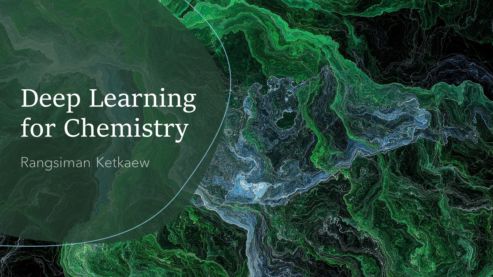

# Deep Learning for Chemistry

    

## การเรียนรู้เชิงลึกเพื่อการประยุกต์ทางเคมี

วิดีโอบน Youtube ที่แชนแนล https://www.youtube.com/rangsiman1993

สอนการประยุกต์ใช้เทคนิคการเรียนรู้เชิงลึกและปัญญาประดิษฐ์สำหรับงานทางด้านเคมี เรียนรู้วิธีการสร้างโมเดลจากชุดข้อมูลโครงสร้างของโมเลกุลเพื่อใช้ในการทำนายคุณสมบัติอื่น ๆ ที่เราต้องการ

| ตอนที่ | เนื้อหา| ลิงก์ | ซอร์สโค้ด |
|-----|-----|-----|-----|
|   1 | Deep Learning สำหรับงานทางเคมี | [คลิก](https://www.youtube.com/watch?v=NEc6by5Dnog) | - |
|   2 | แนะนำเครื่องมือที่จะใช้ในคอร์สนี้ | [คลิก](https://www.youtube.com/watch?v=uaKwpyYh7eQ) | - |
|   3 | การอ่านไฟล์ชุดข้อมูลโมเลกุล | [คลิก](https://www.youtube.com/watch?v=fgHydoP2ZCE) | [ex_1.py](ex_1.py) | 
|   4 | การคำนวณข้อมูลเชิงโครงสร้างเพื่อใช้เป็นฟีเจอร์ | [คลิก](https://www.youtube.com/watch?v=oBSQ5cylIHg) | [ex_2.py](ex_2.py) | 
|   5 | เตรียม input สำหรับการ train model | [คลิก](https://www.youtube.com/watch?v=OaeNhrb8FQ4) | [ex_3.py](ex_3.py) / [ex_3_1.py](ex_3_1.py) / [ex_3_2.py](ex_3_2.py) |
|   6 | ทำความเข้าใจ Hyperparameter | | |
|   7 | ทำนายพลังงานของโมเลกุลด้วย Feedfarward neural network | | |
|   8 | วิเคราะห์ความสามารถของโมเดล | | |
|   9 | ทำนายพลังงานของโมเลกุลด้วย Multi-input neural network | | |
|  10 | ทำนายพลังงานของโมเลกุลด้วย sGDML | | |
|  11 | ทำนายพลังงานของโมเลกุลด้วย Auto Encoder | | |
|  12 | งานวิจัยที่ใช้ Deep Learning สำหรับเคมี | | |
|   X | XXX | xxx | xxx |

 
จัดทำโดย นายรังสิมันต์ เกษแก้ว  
ติดต่อ rangsiman1993@gmail.com
